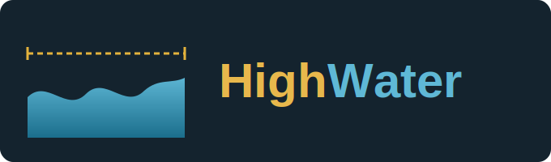

<p align="center">
  
</p>

<p align="center">
  <a href="https://github.com/reganomika/HighWater/actions/workflows/ci.yml"></a>
  <a href="LICENSE"></a>
  <a href="https://github.com/reganomika/HighWater/stargazers"></a>
  
</p>

Context-boundary hygiene for [Claude Code](https://claude.com/claude-code). A `Stop` hook that watches your context size and forces a task-boundary checkpoint, new chat, clear, or continue, before the window quietly burns your token budget or hits auto-compaction.

## Why

Claude Code doesn't warn you before a session's context balloons past the point where quality degrades, or force-compacts near ~99% of the window without asking. HighWater reads real usage straight from the transcript, tracked per model, and hands the choice back to you at 55% and 88%, before the harness makes it for you.

## What's in here

- **`hooks/context-check.sh`**: a `Stop` hook that reads real context size from the transcript and, past a threshold, blocks the response until Claude raises the checkpoint
- **`CLAUDE.md.example`**: the rule that wires the checkpoint behavior (what it offers, how it phrases the question) into Claude's own behavior
- **`/refresh-context-rules`**: on-demand command, see [COMMANDS.md](COMMANDS.md)
- **`tests/`**: a bats suite covering the hook's state machine and checking the docs' quoted percentages against the script (`bats tests/`)

Looking for cost-aware model routing (which subagent tier handles a task) instead of context hygiene? That's a separate tool, [Bullpen](https://github.com/reganomika/Bullpen), safe to install alongside this one.

## Install

```
/plugin marketplace add reganomika/HighWater
/plugin install highwater@highwater
```

On a 1M-context account, set `export CONTEXT_CHECK_WINDOW=1000000` first, the hook defaults to the standard 200K window and can't detect your tier on its own. Full instructions, including the no-plugin-system path, what happens to chats you already have open, and how to disable or remove it: [INSTALL.md](INSTALL.md).

## Docs

- [COMMANDS.md](COMMANDS.md): the one slash command, with a real output example
- [INSTALL.md](INSTALL.md): both install paths, restart caveats, uninstall
- [FAQ.md](FAQ.md): common questions and corner cases

## License

MIT, see `LICENSE`.
